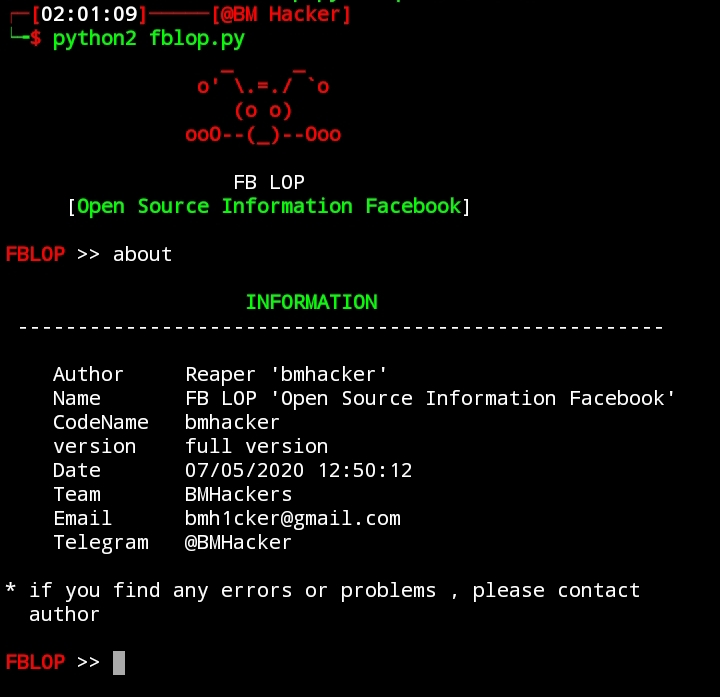

# this project will be stopped for some time to come.

```
                                          _     _
                                        o' \.=./ `o
                                           (o o)          
                                       ooO--(_)--Ooo
                                       
                                          FB LOP
                            [open source information facebook]
```
FBLOP is an accurate facebook account information gathering, all sensitive information can be easily gathered even though the target converts all of its privacy to (only me), Sensitive information about residence, date of birth, occupation, phone number and email address.


## Disclaimer
<b>FBLOP Provides no warranty with this software and will not be responsible for any direct or indirect damage caused due to the usage of this tool.<br>
FBLOP is built for both Educational and Internal use ONLY.</b>

<br>
<p align="center">Made By <a href="//h1ckpro.tk">BM Hacker</a></p>     
<p align="center" style="font-size: 8px">v1.1.0</p>


# [ Installation ]
```
$ pkg update upgrade
$ pkg install git python2
$ git clone https://github.com/bmh1cker/FBLOP
$ cd FBLOP
```

# [ Setup ]
```
$ pip2 install -r requirements.txt
```
# [ Running ]
```
$ python2 fblop.py
```
# [ Screenshot ]


* if you are confused how to use it, please type 'help' to display the help menu
* [Warn] please turn off your VPN before using this program !!!
* [Tips] do not overuse this program !!!

## 🔗 ***Check this***

### Subscribe our channel on youtube:
https://www.youtube.com/bmhacker

### Chekout our webite:
https://h1ckpro.tk

## 👥 ***Join***

### Telegram channel:
https://t.me/bmh1cker

### Facebook page:
https://www.facebook.com/bmh1cker

### Instagram: 
https://www.instagram.com/bmh1cker


Inspired by OSIF (https://github.com/ciku370/OSIF)
